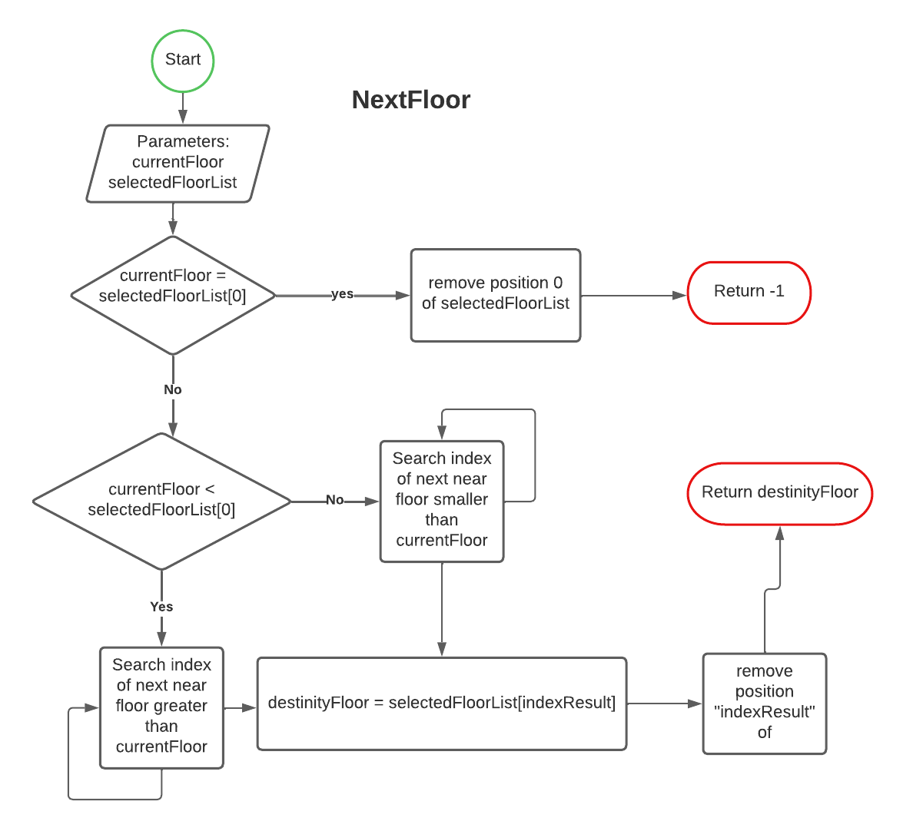

# Semana 1 
## Tarea 1 - Genera el flujo de procesos para el funcionamiento de un elevador/ascensor optimizando la mayor cantidad de recursos posible.

**Diagrama Principal del elevador**

**Funcion NextFloor**

## Tarea 2 -  Haz una lista con las palabras que no conoces de la siguiente imagen y busca su definición.

- **Transaction (transacción):**
    - Son operaciones que se realizan para agregar información a una blockchain
    - (RAE) la acción y efecto de transigir (acordar voluntariamente con otra parte algún punto litigioso para compartir la diferencia de la disputa, consentir a fin de terminar con una diferencia).
    - Tambien llamadas TX, son una transacción es un envío o transferencia de un valor entre dos partes. Pero en realidad, todas estas transacciones no son más que registros guardados dentro de la blockchain de Bitcoin.
- **Exchage (intercambio).**
- **Authenticated (autenticación):** Es verificar una identidad, en blockchain veridica la autenticidad de la wallet
- **Block (bloque):** Es un compartimiento de datos sellados que contiene:
    - Su propio hash de bloque identificador
    - El hash del bloque anterior en la secuencia en cadena
    - Un conjunto de transacciones con marca de tiempo.
- **Node (nodo):** Ordenadores que están interconectados a la red de una blockchain, ejecutando el software que se encarga de todo su funcionamiento.
- **Reward (recompenza):** Es el incentivo por minar un bloque
- **Mining (minar):** Es el proceso de un nodo para generar un bloque, para ello tiene que pasar una prueba para valdiar el trabajo.
- **Proof of Work (prueba de trabajo):** Requisito definido el protocolo de la blockchain, para designar que nodo mina el bloque
- **Cryptocurrency (critomoneda):** Moneda digital decentralizada tipica usada a traves del internet.

## Tarea 3. Explica en un tweet -menos de 280 caracteres- cada uno de los siguientes conceptos:

**Escalabilidad -** Palabra adaptada del ingles, que hace referencia a que un sistema puede adaptarse al incremento de los usuarios sin comprometer el rendimiento y calidad normales del mismo.
**Optimización -** Buscar la mejor manera de realizar un actividad, sin usar recursos en vano.
**Procesos -** Secuencia de eventos o actividades que resuelven un problema.
**Sistemas -** Conjunto de elementos y procesos que se interelacionan y tienen objetivo en común.
**Operaciones -** Ejecución de una acción en particular.