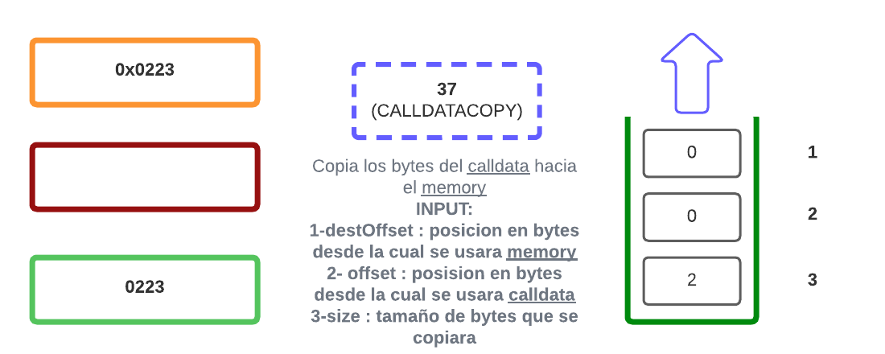
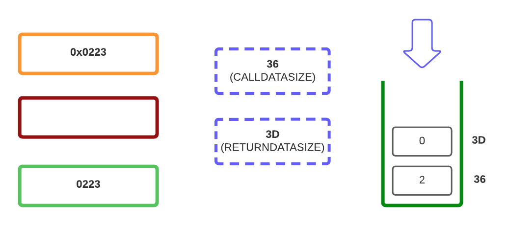

# Semana 3 [](https://platzi.com/clases/3235-ethereum-dev-program/52067-infraestructura-y-funcionamiento-de-la-ethereum-vi/)

## Tarea 1 - Ernesto García Ethereum Developer de Open Zeppelin nos invita a aprender y poner en práctica nuestro conocimientos a través de un repositorio y playground de opcodes EVM.

**Introduccion - Almacenamiento de datos**

En este caso usaremos el siguente input ```0x363d3d37363df3```, este ingresa por calldata y se ejecutara el Opcode **36**

El siguiente es el **3D**( 2 veces)

Ahora **37** usara las entradas en el stack(pila), siendo primero el ultimo que ingresamos.

Volvemos a usar **36** y **3D** llenando nuevamente el stack.

Por último **F3** nos retornara por la pantalla el resultado


**Pueba del resultado**
[](https://www.evm.codes/playground)


- **RECURSOS UTILIZADOS**
    - [Opcodes](https://www.evm.codes)
    - [EMV Playground](https://www.evm.codes/playground)
    - [Documentacion](https://www.evm.codes/about)
